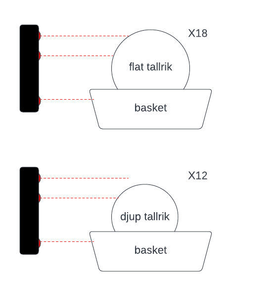

## Prototype A
### harware:
  - lora heltec 32 v2.
  - 3 IR sensors.

### softwere:
  - VSCode and esp-IDf extension.
  - TTN ESP32 library: the lisence of the    library is the libriray exapmles.
  - the prototyp is in C.

### idea of prototype:
Use three IR sensors:
The first sensor detects the basket. Once the basket is detected, the second sensor initiates detection. If the second sensor detects a plate, the third sensor begins detection. If the third sensor detects a plate, it indicates a basket with flat plates. If the first two sensors detect a plate but not the third, it indicates a basket with deep plates.

  
### In case of building the prototype:
It is necessary to find the best place to put each sensor.
   

