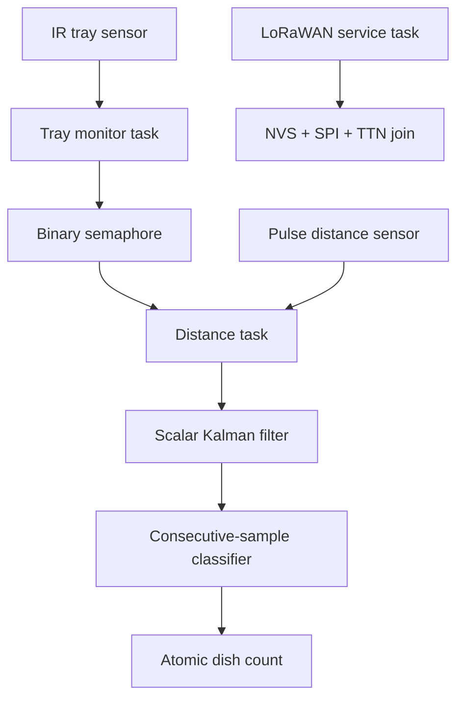

# Firmware architecture

## Purpose and scope

The project is an ESP32 proof of concept that detects a tray with an active-low IR sensor, samples a pulse-output distance sensor, and counts a tray after a stable sequence of classified measurements. LoRaWAN setup is present but deliberately isolated from counting, and telemetry transmission is not yet implemented.

The repository contains one production-shaped firmware under [`firmware/`](../firmware/). The desktop simulator and host tests reuse its hardware-independent filter and classifier; they are verification tools, not alternative firmware.

## Runtime flow

The tray monitor signals only the leading edge of a tray. The distance task then owns a bounded measurement window. Invalid pulses and out-of-range filtered values reset the classification streak; reaching the configured streak increments the atomic count once and closes the window.

The LoRaWAN task initializes and joins independently. It does not currently consume or transmit the count.

## Module boundaries

| Module | Responsibility | Hardware-dependent |
|---|---|---:|
| `main/main.cpp` | Create the semaphore and FreeRTOS tasks; coordinate startup and cleanup | Yes |
| `main/tasks.cpp` | Configure sensors, detect tray edges, measure pulses, own the atomic total | Yes |
| `main/dish_counter_logic.*` | Filter raw measurements and classify consecutive in-range samples | No |
| `main/lorawan_service.*` | Validate credentials, initialize NVS/SPI, provision TTN, retry joins | Yes |
| `main/app_config.h` | Pins, timing, pulse conversion, task sizes and priorities | Yes |
| `main/dish_counter_defaults.h` | Portable classifier thresholds and filter default | No |
| `tools/dish_counter_simulator.cpp` | Replay text traces through the production filter and classifier | No |

## Failure isolation

| Failure | Result |
|---|---|
| Required GPIO initialization fails | Firmware startup aborts because counting cannot operate safely |
| Semaphore or sensor-task creation fails | Created resources are cleaned up and counting does not start partially |
| Distance pulse never changes level | The pulse wait times out and the current classification streak resets |
| Measurement window expires | The tray is rejected without incrementing the count |
| LoRaWAN task cannot be created | Counting continues and a warning is logged |
| NVS, SPI, credentials or provisioning fail | LoRaWAN disables itself; counting continues |
| TTN join fails | The service retries after the configured delay; counting continues |

## Configuration ownership

- Change board pins, timing, pulse conversion and FreeRTOS sizing in `firmware/main/app_config.h`.
- Change portable distance thresholds, required samples and Kalman measurement error in `firmware/main/dish_counter_defaults.h`.
- Supply DevEUI, AppEUI and AppKey through `idf.py menuconfig` under **Dish counter configuration**. They are not committed.

Compile-time assertions reject inverted distance ranges, a zero sample requirement and a zero pulse-conversion denominator.

## Verification layers

| Layer | What it proves | What it does not prove |
|---|---|---|
| Host unit tests | Filter behavior, streak rules, reset behavior and inclusive thresholds | GPIO, scheduling or real sensor behavior |
| Trace simulator | End-to-end decisions for recorded or synthetic raw samples | Electrical timing, calibration or FreeRTOS behavior |
| Windows and Ubuntu CI | CMake portability across MSVC and GCC | Embedded integration |
| ESP-IDF CI build | Firmware sources and vendored TTN component compile for ESP32 | Flashing or physical operation |
| Future hardware validation | Pinout, electrical levels, calibration and real counting accuracy | Not currently available |

## Known gaps

- Distance thresholds and pulse conversion have not been calibrated on the intended hardware.
- The count is volatile and is lost on restart.
- LoRaWAN payload format, cadence, transmission and backend integration remain undefined.
- CI firmware artifacts contain no LoRaWAN credentials; the radio service will remain disabled until a locally provisioned build is flashed.
- The pulse input is measured by bounded polling rather than a capture peripheral or interrupt-driven driver.
- There is no hardware-in-the-loop test rig.
- The repository does not yet declare a top-level project license; choose one before distributing the project beyond private evaluation.
