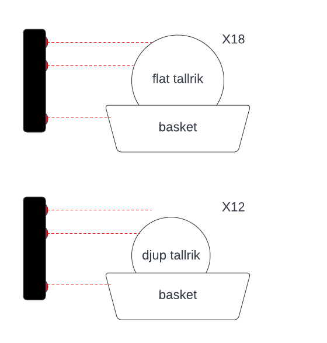

# Historical Prototype A

Prototype A was the project's first ESP32 experiment. It is retained here as a design record, not as buildable firmware. The canonical implementation is in [`firmware/`](../firmware/).

## Original concept

Three active-low IR sensors classified baskets by their contents:

- GPIO 17 detected a basket.
- GPIO 13 detected a deep plate.
- GPIO 21 distinguished a flat plate after the deep-plate sensor fired.

A basket that reached both plate sensors was classified as flat; a basket that reached only the deep sensor was classified as deep. The prototype estimated totals using fixed capacities of 18 flat plates or 12 deep plates per basket. After 30 seconds without a basket, it attempted to transmit the accumulated total as a two-byte LoRaWAN payload and reset the batch counters.

## Why the firmware was retired

Keeping Prototype A as a second ESP-IDF application created two competing implementations with different sensors and counting semantics. The old code also:

- coupled all sensor tasks to a successful LoRaWAN join;
- used placeholder credentials in source code;
- coordinated behavior through unsynchronized global flags and counters;
- did not check task-creation results;
- had no automated build or logic tests;
- assumed fixed basket capacities without a validated product requirement.

The current firmware uses an IR tray trigger and pulse-output distance sensor, starts counting independently of LoRaWAN, isolates its domain logic, and is covered by host tests plus an ESP-IDF build.

## Ideas worth preserving

Flat-versus-deep classification and inactivity-triggered batch reporting may still be useful product features. They should be reintroduced only after confirming the required sensors, basket capacities, payload format, and backend behavior. If revived, they belong in hardware-independent domain logic with recorded sensor traces and tests—not in another parallel firmware directory.
